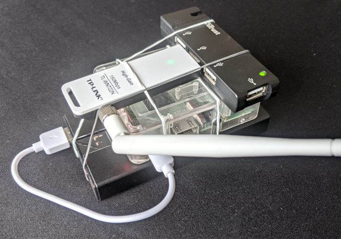
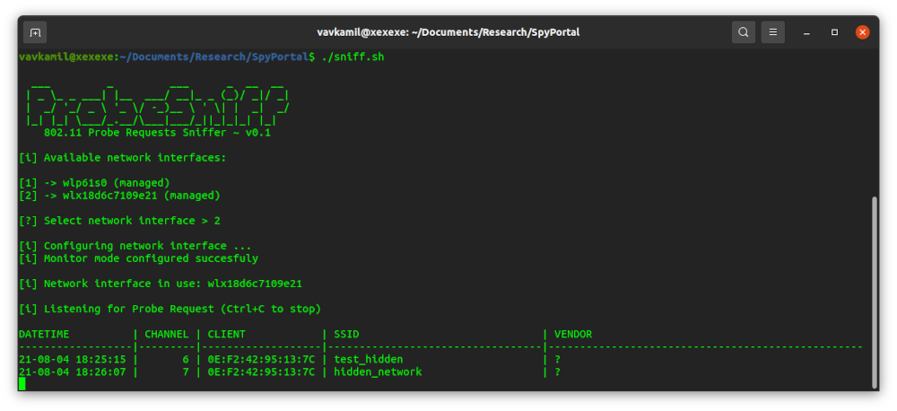
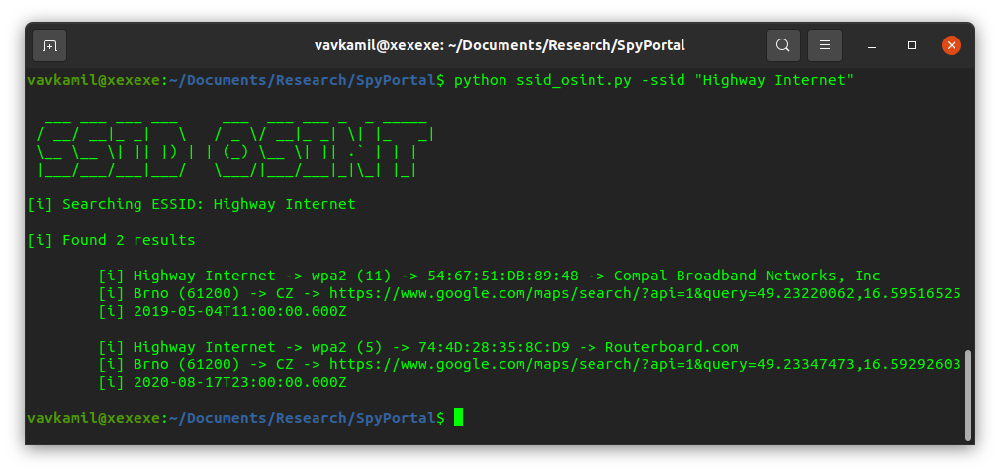
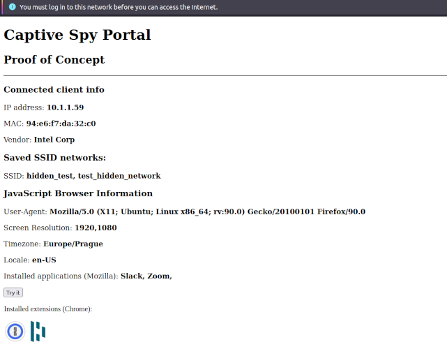

# SpyPortal
Sniffing &amp; geolocating saved SSIDs

## OWASP Czech Chapter Meeting
[August 5, 2021 | By @vavkamil](https://www.eventbrite.com/e/owasp-czech-chapter-meeting-registration-162360236839)

**I know where you live**

_An introduction into the KARMA attack, exploiting the behavior of some Wi-Fi devices, where vulnerable clients broadcast a "preferred network list" (PNL), which contains the SSIDs of access points to which they have previously connected. We will revisit the old technique, current defenses applied by vendors and build a custom access point using Raspberry Pi & Python._

---

### Slides

[xss.vavkamil.cz/owasp](https://mark.show/https://xss.vavkamil.cz/owasp/i-know-where-you-live.md#/)

### Proof of Concept



### Usage

```
$ pip3 install -r requirements/requirements-probe_sniff.txt
$ sudo /home/${USER}/.pyenv/shims/python3 probe_sniff.py

$ pip3 install -r requirements/requirements-ssid_osint.txt
$ python3 ssid_osint.py -ssid "McDonald's FREE WIFI" -city "Brno"
```

### Captive Portal

Use `index.php` with [Building a Rogue Captive Portal with the Raspberry Pi](https://jerryryle.github.io/rogueportal/)

### Example






